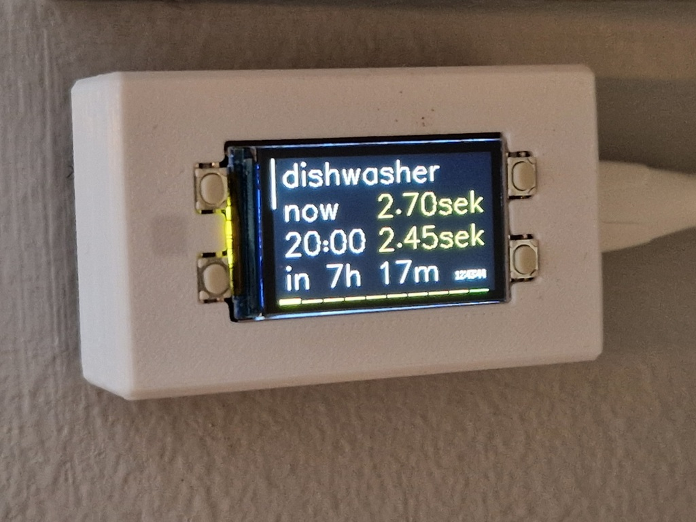
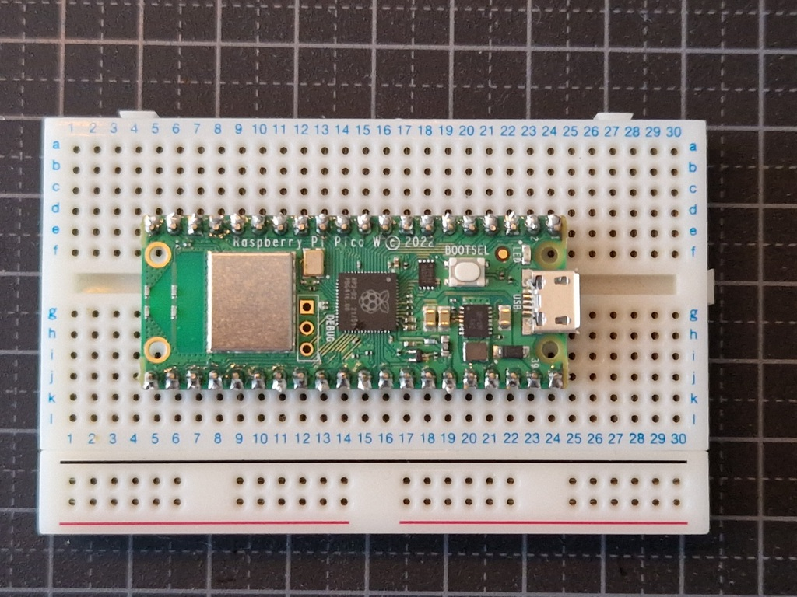
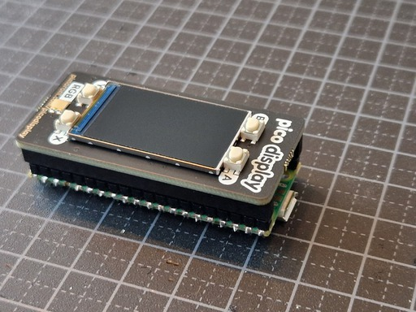
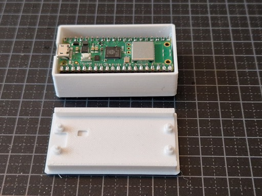
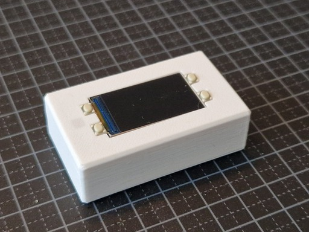

# eltim

A gadget to show the cheapest time to use your appliances (dishwasher, tumble dryer, etc) when you have an hourly agreement with [Tibber](https://tibber.com/se). The display shows the cost to run the appliance now compared to the cheapest time. The led is red or green when it's expensive or cheap. The top left button toggles through different appliances, and the bottom right button shows the cost at different times.

A more complex build allows you to make [dumb appliances smarter](TIMER.md), allowing them to automatically start when the electricity is cheaper. 



## Hardware

To build this you need:

- [Raspberry Pi Pico WH](https://www.raspberrypi.com/products/raspberry-pi-pico/)
- [Pico Display Pack](https://shop.pimoroni.com/products/pico-display-pack)
- [3d printed case downloaded from Printables](https://www.printables.com/model/326265-raspberry-pi-pico-pico-display-pack-case)
- USB power supply with a mirco USB cable


## Build

If you bought a Raspberry Pi Pico W without headers you first need to solder the headers onto the board, otherwise you can skip this step:



Attached the Pico Display Pack to the Raspberry Pi Pico W:

   

Press fit the Pico assembly into the case and then attach the base:



Fully assembled:




## Install

Install MicroPython with support for the Pico Display Plack from [pimoroni/pimoroni-pico](https://github.com/pimoroni/pimoroni-pico/releases/latest/). Follow the [Installing the custom firmware](https://learn.pimoroni.com/article/getting-started-with-pico) instructions.

Then install the eltim app using:
```
mpremote connect /dev/tty.usbmodem14??? mip install --target . github:rtitmuss/eltim/picokernel/main.py
mpremote connect /dev/tty.usbmodem14??? soft-reset mip install --target picokernel github:rtitmuss/eltim/picokernel
mpremote connect /dev/tty.usbmodem14??? soft-reset mip install --target app github:rtitmuss/eltim
```

When the device starts it checks for app updates, and automatically installs them from github.

## Configuration

On the device filesystem copy `app/config_example.py` to `config.py`. You then need to edit the file.

Add you wifi ssid and password:

```
WIFI_SSID = 'ssid'
WIFI_PASSWORD = 'password'
```

Get an access token from Tibber from [https://developer.tibber.com/settings/access-token](https://developer.tibber.com/settings/access-token):

```
TIBBER_TOKEN = 'token'
```

Choose if you want to rotate the display:

```
ROTATE = False
```

Add your timezone and currency:

```
TIMEZONE = 'Europe/Stockholm'
CURRENCY = 'sek'
```

You can add the grid price (for example Ellevio) in kWh, this is added to the Tibber prices. 

```
GRID_PRICE = 0.27 + 0.45 + 0.0596
```

Finally configure your appliances with a name and consumption per hour. Examples are includes for a dishwasher, washing machined and tumble dryer. 

```
APPLIANCE = [{
    'name': 'washer',
    'kwhPerHour': (0.9, 0.1)
}]
```

Save the updated configuration file and restart the device. It will then connect to your wifi and download the latest electricity prices from Tibber. Enjoy! 


## Development

Before submitting PRs format the files using `yapf -i *.py`
