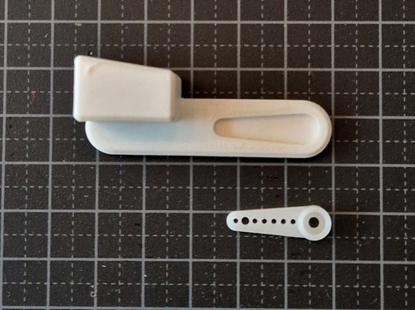
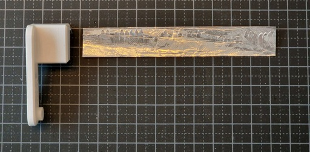
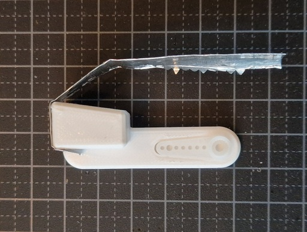
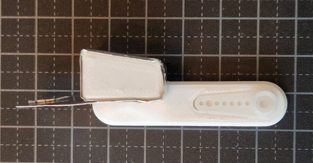
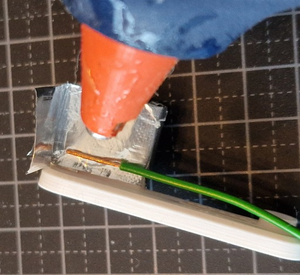
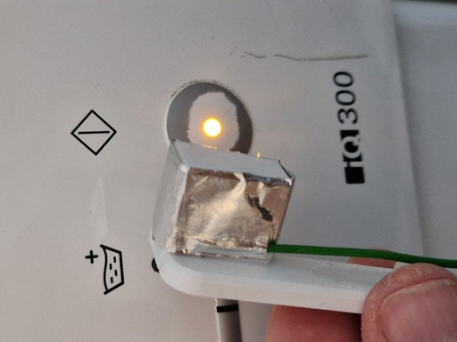
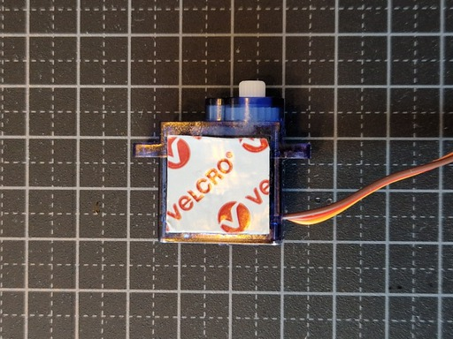
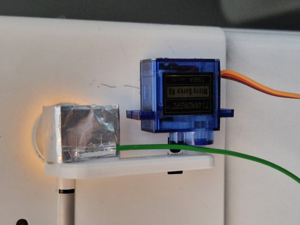
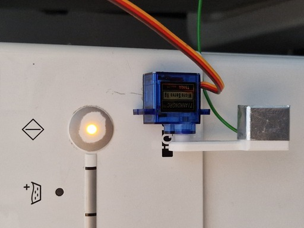

# Timer

A more advanced way to use eltim is as a timer to make dumb appliances smarter. This simple upgrade is much cheaper than replacing my existing appliances with new smart appliances.

TODO ... more instructions ...

## Hardware

The following parts are needed for each switch:

- Servo motor
- 3d printed finger
- Aluminum foil
- 20 cm wire
- Velcro pads

## Capacitive button presser

My washing machine and tumble dryer are started using a capacitive button. The following instructions are for a capacitive button presser.

Press fit the servo horn into the printed part:

Prepare a length of aluminum foil, fold it half so it is shiny on both sides:

Use a hot glue gun to attach the aluminum foil to the printed part:

Strip the end off the 20cm wire and hot glue this to the aluminum foil. This is needed to add capavitance so the button activates:

Not test to make sure that the button activies when the 3d printed finger touches the appliance switch.

Add velcro pads to the servo motor:

Attach the servo motor to the appliance:

Remove the finger from the servo. Power on eltim and wait for the servo to reset it's position, then install the finger in the open position.

